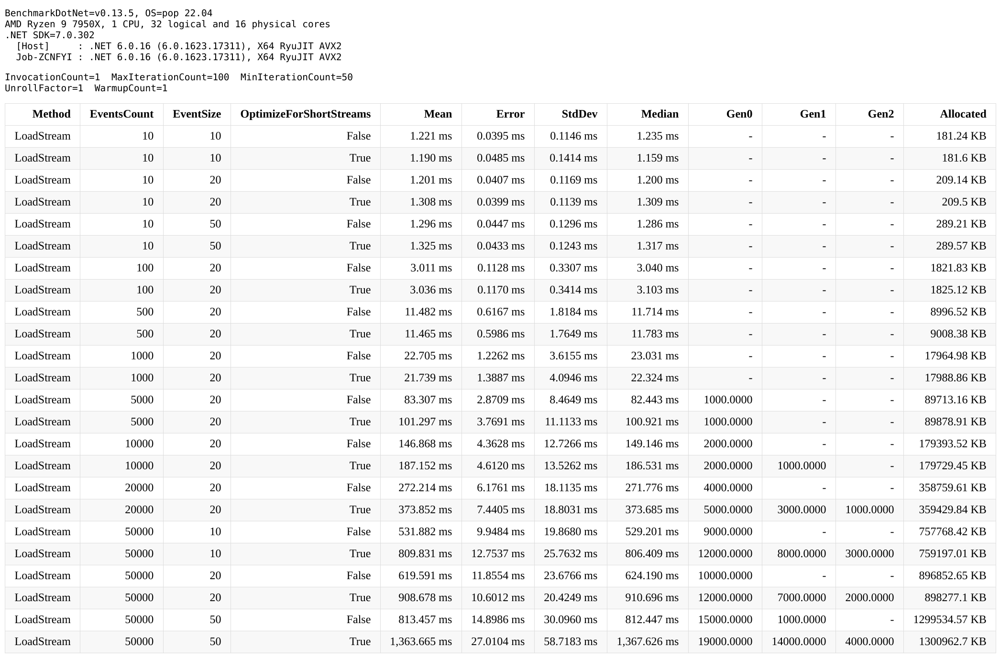
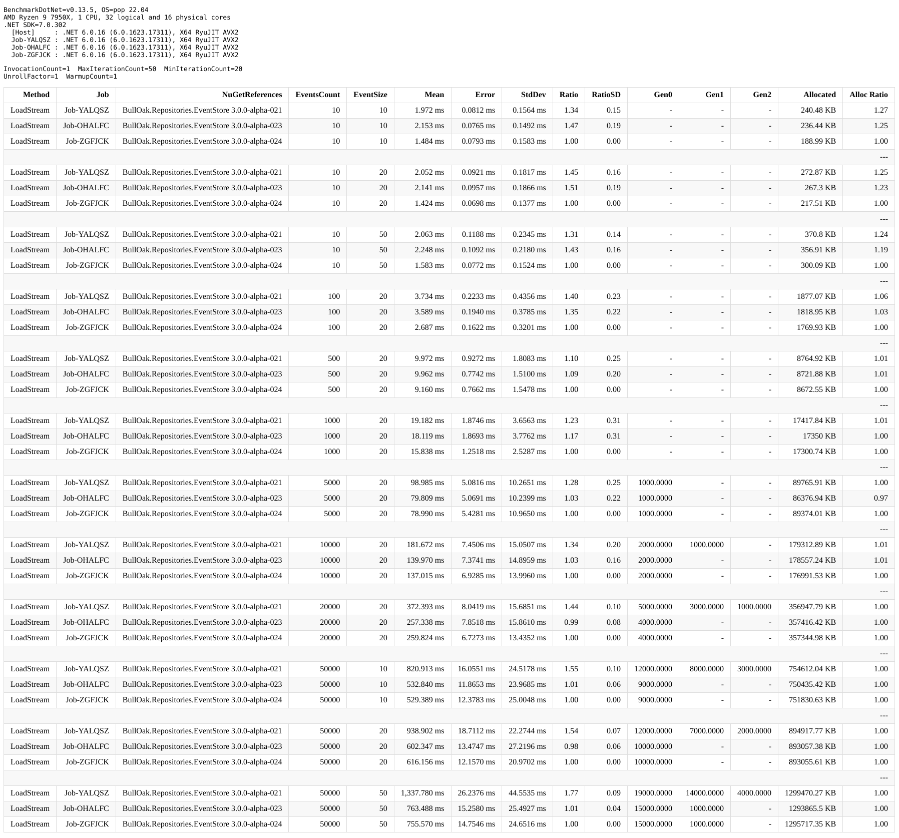

# BullOak EventStore Benchmark

## Benchmarks

Implemented using [BenchmarkDotNet](https://github.com/dotnet/BenchmarkDotNet).

At the moment one [benchmark test](./ReadEventStreamBenchmark.cs) is
implemented - reading events from event stream.
(Technically there is [another one](./WriteEventStreamBenchmark.cs), but
it exists only to prepare the data in the EventStore for the reading test).

The main objective of this test is to see how BullOak behaves when dealing
with large number of events in an event stream when loading events and
rehydrating the state.

Benchmark has following parameters (passed into test by BenchmarkDotNet,
set of values specified via attributes in the
[test code](./BenchmarkParameters.cs)):

* `EventsCount` to control the number of events in an event stream
* `EventSize` to control event size
* `OptimizeForShortStreams` (new parameter since `3.0.0-rc1`) whether to use
  arrays for short streams or `IAsyncEnumerable`s for long streams

## Running benchmark

> Benchmark test makes frequent requests to the EventStoreDB, and this may
> exhaust OS TCP connection limits. Symptom is that you will see GRPC exception
>
> ```txt
> Grpc.Core.RpcException: Status(
>   StatusCode="ResourceExhausted",
>   Detail="Error starting gRPC call.
>     HttpRequestException: An error occurred while sending the request.
>     IOException: The request was aborted.
>     Http2StreamException: The HTTP/2 server reset the stream. HTTP/2 error code 'ENHANCE_YOUR_CALM' (0xb).",
>   DebugException="System.Net.Http.HttpRequestException: An error occurred while sending the request.")
> ```
>
> As a workaround, we may use one of the two following options.
>
> First option is to increase OS TCP connections limits. In Linux that would be
> something similar to this:
>
> ```bash
> sudo sysctl net.core.netdev_max_backlog=10000
> sudo sysctl net.ipv4.tcp_max_syn_backlog=10000
> ```
>
> (see <https://stackoverflow.com/a/3923785>)
>
> Second option would be to use a small delay before each job iteration.
>
> Second option (explicit delay) seems to be more reliable.

Start EventStore V22 instance with default authentication settings.

You may use Docker Compose and configuration file included in this project:

```bash
docker compose -p esdb -f esdb_v5_v22.yml up -d
```

(this Docker Compose file is also suitable for using with integration tests,
this is why it starts both ESDB V5 and ESDB V22)

Prepare the data for read benchmark test:

> ***IMPORTANT:***
>
> * This step needs to be run after set of benchmark parameters is modified
>   or when starting EventStoreDB from a clean state.
> * This step takes *long time* to complete.

```bash
dotnet run -c Release -- --filter '*WriteEventStreamBenchmark*'
```

Run benchmark:

> This step can be repeated as many times as needed given that
> benchmark parameters stay the same

```bash
dotnet run -c Release -- --filter '*ReadEventStreamBenchmark*'
```

Stop and clean up ESDB:

```bash
docker compose -p esdb -f esdb_v5_v22.yml down
docker volume rm esdb_eventstore_v5-data
docker volume rm esdb_eventstore_v22-data
docker volume prune -f
```

## Results

### `3.0.0-rc1`



* [Full report](./BenchmarkReports/Benchmark-3.0.0-rc1-Full.html)
* [Short report](./BenchmarkReports/Benchmark-3.0.0-rc1-Full.html) with most
  permutations excluded, it is easier to read but still provides a good overview

Major differenced compared to previous versions:

* `3.0.0-rc1` allows to explicitly optimise for desired mode of operation
  by using `optimizeForShortStreams` parameter
* `3.0.0-alpha24` was optimised for long streams
* `3.0.0-alpha24` was optimised for short streams

> Note that `3.0.0-rc1` and `3.0.0-alpha24` have some other optimisations,
> e.g. reducing the number of network calls to EventStore server.
> These optimisations however may not directly affect time spent in loading
> stream or memory allocated, so these improvements will not affect
> BenchmarkDotNet results.  

Results can be interpreted using following categories:

#### Short event streams, `optimizeForShortStreams=true`

In this category `3.0.0-rc1` performance is very close to `3.0.0-alpha24`,
memory allocations numbers are very close, time spent is slightly better in
`3.0.0-rc1` (1.3ms) compared to `3.0.0-alpha24` (1.5ms).

#### Short event streams, `optimizeForShortStreams=false`

In this category `3.0.0-rc1` performance is better than `3.0.0-alpha21`:
e.g. for stream length 20 time spent reduced from 2.0ms to around 1.2ms;  memory allocations
reduces from 270KB to 210KB.

#### Long event streams, `optimizeForShortStreams=true`

In this category `3.0.0-rc1` performance is very close to `3.0.0-alpha21`,
both in terms of time spent and memory allocations.

Worth noting that same as with `3.0.0-alpha21`, when loading long streams
we see large number of GC Gen1 and Gen2 collection, so memory pressure is high.

#### Long event streams, `optimizeForShortStreams=false`

In this category `3.0.0-rc1` performance is very close to `3.0.0-alpha24`:
memory allocations are pretty much identical; slightly longer time
spent loading stream - 813ms for `3.0.0-rc1` vs 756ms for `3.0.0-alpha24`.

### Comparing versions prior to the `3.0.0-rc1`

Introduction of the new parameter `optimizeForShortStreams` in `BeginSessionFor`
made it impossible (or, at least very much non-trivial) to compare `3.0.0-rc1`
with prior versions `3.0.0-alphaX` or `2.x` directly, using the same
benchmark project.

Benchark results from the latest version `3.0.0-rc1` can be cross-referenced
with results for previous versions manually.



* [Full report for previous versions](./BenchmarkReports/Benchmark-3.0.0-alpha24-Full.html)
* [Short report for previous versions](./BenchmarkReports/Benchmark-3.0.0-alpha24-Full.html)
  with most permutations excluded, it is easier to read but still provides
  a good overview
